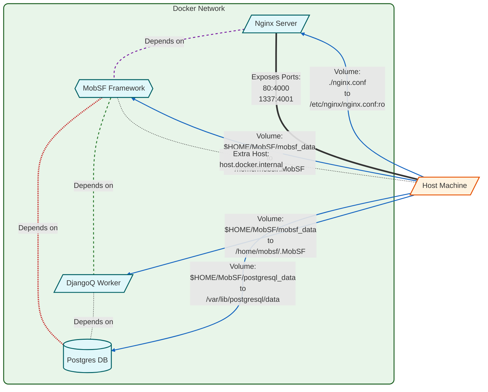

# Docker Options

## Docker
#### DockerHub の事前ビルド済みイメージ

```bash
docker pull opensecurity/mobile-security-framework-mobsf:latest
docker run -it --rm -p 8000:8000 opensecurity/mobile-security-framework-mobsf:latest
```

#### 永続化（persistence）

```bash
# On Linux
mkdir <your_local_dir>
sudo chown -R 9901:9901 <your_local_dir>

docker run -it --rm --name mobsf -p 8000:8000 -v <your_local_dir>:/home/mobsf/.MobSF opensecurity/mobile-security-framework-mobsf:latest
```

#### volume mount 利用時の MobSF バージョン更新

```bash
# On Linux
docker pull opensecurity/mobile-security-framework-mobsf:latest
# Apply database migrations
docker run --rm -v <your_local_dir>:/home/mobsf/.MobSF opensecurity/mobile-security-framework-mobsf:latest scripts/migrate.sh
```

#### 非同期スキャンキューの設定

非同期スキャンキューでは、MobSF とスキャンキューのオーケストレータである DjangoQ2 の間でデータを共有するため、共有の volume mount が必要です。

```bash
# Run MobSF container with Asynchronous scan support.
docker run -it --rm --name mobsf -v ~/.MobSF:/home/mobsf/.MobSF -e MOBSF_ASYNC_ANALYSIS=1 -p 8000:8000 opensecurity/mobile-security-framework-mobsf:latest

# Run DjangoQ2 cluster to accept scan jobs.
docker run -it --rm --name djangoq -v ~/.MobSF:/home/mobsf/.MobSF opensecurity/mobile-security-framework-mobsf:latest scripts/qcluster.sh
```

#### Dockerfile からイメージをビルドする

```bash
git clone https://github.com/MobSF/Mobile-Security-Framework-MobSF.git
cd Mobile-Security-Framework-MobSF
docker build -t mobsf .
docker run -it --rm -p 8000:8000 mobsf
```

#### プロキシ配下で Dockerfile からイメージをビルドする

```bash
docker build --build-arg https_proxy="https://${PROXY_IP}:${PROXY_PORT}" --build-arg http_proxy="${PROXY_IP}:${PROXY_PORT}" --build-arg NO_PROXY="127.0.0.1" -t mobsf .
```

環境変数 `PROXY_IP` にプロキシの IP アドレス、`PROXY_PORT` にプロキシのポートを設定してください。

#### Dockerfile からイメージをゼロから再ビルドする

```bash
docker build --no-cache --rm -t mobsf .
```

#### mobsf コンテナのログを確認する

```bash
docker logs -f --tail 100 mobsf
```
## Docker Compose
<a id="for-postgres-and-nginx-reverse-proxy-support"></a>
#### Postgres データベース、DjangoQ2 タスクキュー、Nginx リバースプロキシ対応

```bash
# On Linux
mkdir -p $HOME/MobSF/mobsf_data
sudo chown -R 9901:9901 $HOME/MobSF/mobsf_data

cd docker

# Download the latest images 
docker compose pull

# Launch the services
docker compose up

# or run in the background
docker compose up -d

# See logs from mobsf container
docker compose logs -f mobsf 

# See scan logs from the djangoq container
docker compose logs -f djangoq

# Stop the containers
docker compose down

# Updating MobSF
docker compose pull
docker compose run mobsf scripts/migrate.sh
```

### Architecture（構成）



**MobSF 向け Docker Compose 構成**

この構成では、データベースに PostgreSQL、リバースプロキシに Nginx を使い、DjangoQ2 による非同期スキャンにも対応して MobSF を起動します。

Services:

1. postgres
   - Image: PostgreSQL 13 イメージ
   - Purpose: MobSF のデータベースバックエンド
   - Configuration:
     * データ保存用の永続ボリューム
     * データベース認証情報用の環境変数
     * mobsf_network に接続

2. nginx
   - Image: 最新の Nginx イメージ
   - Purpose: リバースプロキシ兼 Web サーバー
   - Configuration:
     * ポート 80 と 1337 を公開
     * カスタム Nginx 設定ファイルをマウント
     * mobsf サービスに依存
     * mobsf_network に接続

3. mobsf
   - Image: 最新の MobSF イメージ
   - Purpose: Mobile Security Framework アプリケーションを実行
   - Configuration:
     * `/home/mobsf/.MobSF` に MobSF データ永続化用ボリュームをマウント
     * PostgreSQL 接続用の環境変数
     * postgres サービスに依存
     * adb 接続用に Docker ホストへアクセスするための extra host 設定
     * mobsf_network に接続

4. djangoq
   - Image: 最新の MobSF イメージ
   - Purpose: MobSF の非同期タスクキューを管理する DjangoQ2 を実行
   - Configuration:
     * Command: `qcluster.sh` を実行して DjangoQ2 クラスタを起動
     * `/home/mobsf/.MobSF` に MobSF データ永続化用ボリュームをマウント
     * PostgreSQL 接続用の環境変数
     * postgres サービスに依存
     * mobsf_network に接続

Network:
   - サービス間通信用にカスタム bridge ネットワーク `mobsf_network` を作成

Note: 障害時は各サービスが自動再起動するよう設定されています。DjangoQ のみ、停止するまで再起動する設定です。
